 

### Welcome to My NFL Salaries Regression Project Page
#### (Regression work half-way down)


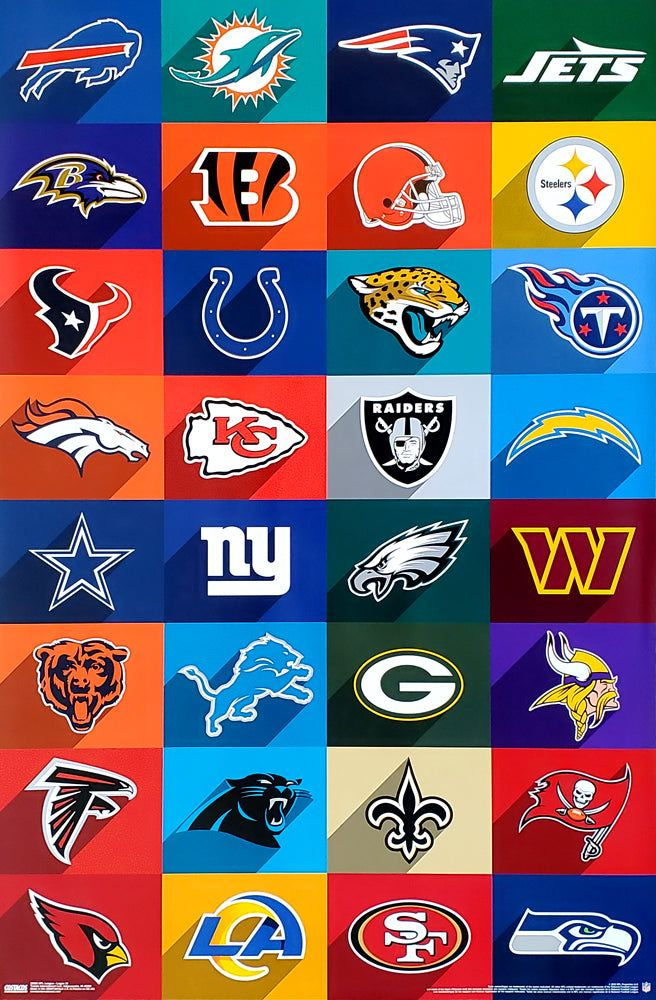


_1/7/2026_  
I'm a pro football fan and root for my hometown team, the Chicago Bears.  I'm excited about the team's direction.  We have a great new coach, Ben Johnson, who has led the Bears to offensive production near the top of the NFL.  The Bears made the playoffs this year for the first time since 2020.  They've had a rough last 20 years.  The only other times they've made it to the playoffs since their Super Bowl appearance in 2006 were in 2010 and 2018.  I'm hoping for some better years ahead.

A big topic of conversation in professional sports is salaries.  I hear a lot of people say so-and-so deserves to get paid, they deserve their money!  When players do get paid, sometimes they play well and sometimes they don't.  Sometimes they get injured and their salary is wasted.  With the playoffs upon us, I thought it would be interesting to see who's getting paid the big bucks and whether their teams are in the playoffs.  Are the big money players worth it?  How much do they influence a team's performance?

I looked up the top salaries in the NFL and found this site.  [Top 25 NFL Salaries in 2025](https://www.nfl.com/photos/ranking-the-nfl-s-biggest-contracts-for-2025).  Let's compare the top money players to their team's performance in 2025.  Note there are 32 teams in the NFL, 16 teams in each Conference (NFC and AFC), and 14 make the playoffs.

_I will list player salaries in order, but multiple players from the same team together._

### Salary and Team Outcome:

##### #1 **Dak Prescott (QB) - $60M, Dallas Cowboys**, team record: 7-9-1, 2nd NFC East, 12th in NFC
- The top salary player in the league did not make the playoffs.
- _MISSED PLAYOFFS_

##### #2 (tie) **Josh Allen (QB) $55M, Buffalo Bills**, team record: 12-5, 2nd AFC East, tied for 5th best record in NFL
- The Buffalo Bills are a perennial force.
- PLAYOFF TEAM

##### #2 (tie) **Joe Burrow (QB) $55M, Cincinnati Bengals**, team record: 6-11, 11th in AFC  
##### #19 **Ja'Marr Chase (WR) $40.25M, Cincinnati Bengals**
- Cincinnati was supposed to be a Super Bowl contender with their high-flying offense.  Perhaps they spent too much on their top players.
- _MISSED PLAYOFFS_

##### #2 (tie) **Trevor Lawrence (QB) $55M, Jacksonville Jaguars**, team record: 13-4, 1st AFC South, 4th best record in NFL
- Lawrence entered the league in 2021 and in his 5th season has the Jaguars rolling
- PLAYOFF TEAM

##### #2 (tie) **Jordan Love (QB) $55M, Green Bay Packers**, team record: 9-7-1, 2nd NFC North, 7 seed in NFC Playoffs  
##### #12 **Micah Parsons (LB) $46.5M, Green Bay Packers**
- Green Bay spent more money on top players than Cincinnati, but they have a much better record.
- PLAYOFF TEAM

##### #6 **Tua Tagovailoa (QB) $53.1M, Miami Dolphins**, team record: 7-10, 3rd AFC East, 10th in AFC
- _MISSED PLAYOFFS_

##### #7 (tie) **Brock Purdy (QB) $53M, San Francisco 49ers**, team record: 12-5, tied for 5th best record in the NFL
- Purdy earned less than $2M/year in 2023 and 2024, but he led the 49ers to the Super Bowl in 2023.  Last year the team went 6-11.  With Purdy starting they were 6-9.  This year Purdy's record was 7-2.  He missed 8 games due to injury.
- [Brock Purdy 2023 Salary Comparison](https://www.espn.com/espn/feature/story/_/id/38512080/nfl-quarterbacks-earn-san-francisco-49ers-brock-purdy-salary)
- PLAYOFF TEAM

##### #7 (tie) **Jared Goff (QB) $53M, Detroit Lions**, team record: 9-8, 9th in NFC  
##### #15 (tie) **Aidan Hutchinson (DE) $45M, Detroit Lions**
- _MISSED PLAYOFFS_

##### #9 **Justin Herbert (QB) $52.5M, Los Angeles Chargers**, team record: 11-6, 2nd AFC West, 7 seed in AFC Playoffs
- PLAYOFF TEAM

##### #10 **Lamar Jackson (QB) $52M, Baltimore Ravens**, team record: 8-9, 9th in AFC
- _MISSED PLAYOFFS_

##### #11 **Jalen Hurts (QB) $51M, Philadelphia Eagles**, team record: 11-6, 1st NFC East, 3 seed in NFC Playoffs
- PLAYOFF TEAM

##### #13 **Kyler Murray (QB) $46.1M, Arizona Cardinals**, team record: 3-14, 16th in NFC
- _MISSED PLAYOFFS_

##### #14 **Deshaun Watson (QB) $46M, Cleveland Browns**, team record: 5-12, 13th in AFC  
##### #20 (tie) **Myles Garrett (DE) $40M, Cleveland Browns**
- 2025 was Watson's 4th year on a huge contract with Cleveland.  He didn't play all year due to injury, and he missed half of last season as well.
- _MISSED PLAYOFFS_

##### #15 (tie) **Patrick Mahomes (QB) $45M, Kansas City Chiefs**, team record: 6-11, 12th in AFC
- Mahomes has played in the Super Bowl 5 times and won 3.
- _MISSED PLAYOFFS_

##### #15 (tie) **Kirk Cousins (QB) $45M, Atlanta Falcons**, team record: 8-9, 11th in NFC
- Cousins signed a big contract in 2024 and played most games that season.  He was replaced by the #8 pick rookie quarterback Michael Penix Jr. at the end of the season.  Cousins didn't play much this season until Penix Jr. got injured, and Cousins ended the season with a 5-2 record.
- _MISSED PLAYOFFS_

##### #18 **T.J. Watt (OLB) $41M, Pittsburgh Steelers**, team record: 10-7, 1st AFC North, 4 seed in AFC Playoffs
- PLAYOFF TEAM

##### #20 (tie) **Matthew Stafford (QB) $40M, Los Angeles Rams**, team record: 12-5, 2nd NFC West, tied for 5th best record in NFL
- PLAYOFF TEAM

##### #22 **Geno Smith (QB) $37.5M, Las Vegas Raiders**, team record: 3-14, 14th in AFC  
##### #24 **Maxx Crosby (DE) $35.5M, Las Vegas Raiders**
- _MISSED PLAYOFFS_

##### #23 **Danielle Hunter (DE) $35.6M, Houston Texans**, team record: 12-5, 2nd AFC South, tied for 5th best record in NFL
- PLAYOFF TEAM

##### #25 **Justin Jefferson (WR) $35M, Minnesota Vikings**, team record: 9-8, 8th in NFC
- _MISSED PLAYOFFS_
  
  
20 teams in the NFL paid at least one player a top-25 salary in 2025.  Only 9 of those teams made the playoffs.  It's also interesting to note that the three teams tied in the NFL with the best record at 14-3, the Denver Broncos, New England Patriots, and Seattle Seahawks, did not pay any player on their team a top-25 salary.  In 2023 Brock Purdy led the San Francisco 49ers to the Super Bowl on a rookie contract worth less than $2M/year.  The Denver Broncos and New England Patriots have quarterbacks on rookie contracts worth $5M/year and $9M/year respectively.  The Chicago Bears and Carolina Panthers also made the playoffs, with quarterbacks on rookie contracts earning $9M-$10M/year, and no players with top-25 salaries.  The Houston Texans round out the five teams in the playoffs this year with quarterbacks on rookie contracts.

_2/16/2025 update_
>The conference championship games featured the Denver Broncos versus the New England Patriots, and the Seattle Seahawks versus the Los Angeles Rams.  The highest paid player from those teams was Matthew Stafford, QB of the Rams.  The Seattle Seahawks and New England Patriots went on to the Super Bowl, where the Seahawks were victorious with their stifling defense.
    
With so many teams paying players big salaries and missing the playoffs, I decided to perform a regression study on player salaries, income inequality, and team records.

### Data Sets Used
I started with a player salary dataset from Kaggle [Player Salaries](https://www.kaggle.com/datasets/f4k25g/nfl-salaries).  The dataset has player salary cap hit and percent of team cap hit by year for all players on all teams from 2014-2020.  I also downloaded team statistics data for all teams from 2003-2023 [NFL Team Data](https://www.kaggle.com/datasets/nickcantalupa/nfl-team-data-2003-2023).  The team stats data has several offensive productivity measures like yards per play, touchdowns, passing yards, etc. as well as wins, win-loss percentage, and points allowed by defense.

I decided to measure team success with the win-loss percentage variable (win rate).  I created a new variable, salary cap hit gini coefficient (cap_hit_gini_coef) to measure income inequality on each team.  The formula I used for gini coefficient is derived from this summary [Gini Coefficient Explanation and Formulas](https://www.statsdirect.com/help/nonparametric_methods/gini.htm).

I began my regression by testing the win-loss percentage variable for normality.  The Q-Q Plot below seems to indicate a normal distribution, but the values are stepped, because teams play 16 games a season (17 starting in 2020).  There are occasionally ties, but those are rare.  There are a limited number of possible win-loss percentages possible.  The low win rate in the middle of the graph comes from the 2020-2023 seasons when teams started playing an extra game each year.  Since there are fewer seasons with 17 game years, the 8/17 win rate of 0.47 was less common than the 7/16 win rate of 0.4375, and than other bucketed win rates.

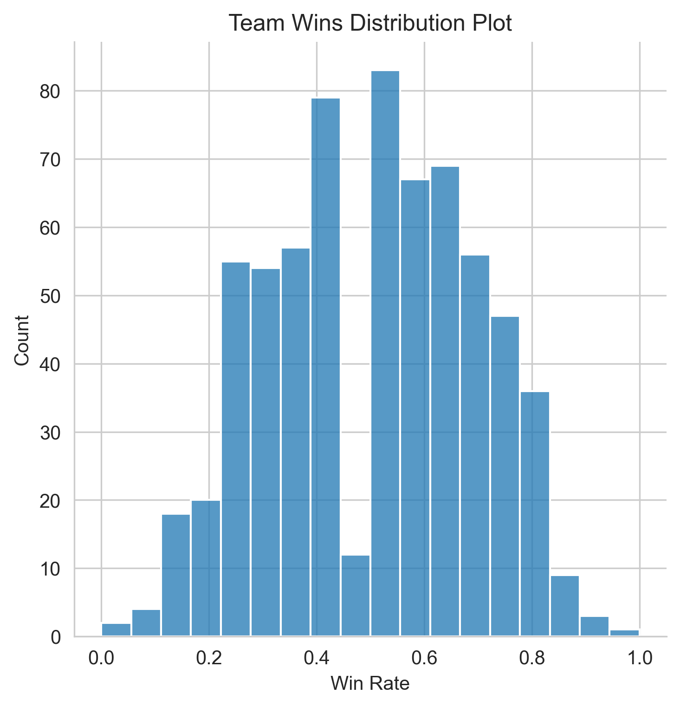
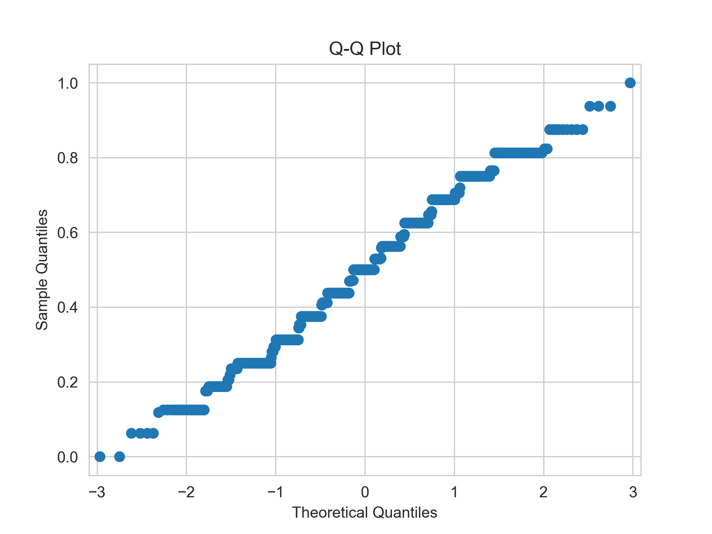

When I removed the 2020-2023 years, the distribution plot appeared more normal, and the Q-Q plot appeared more stepped.  

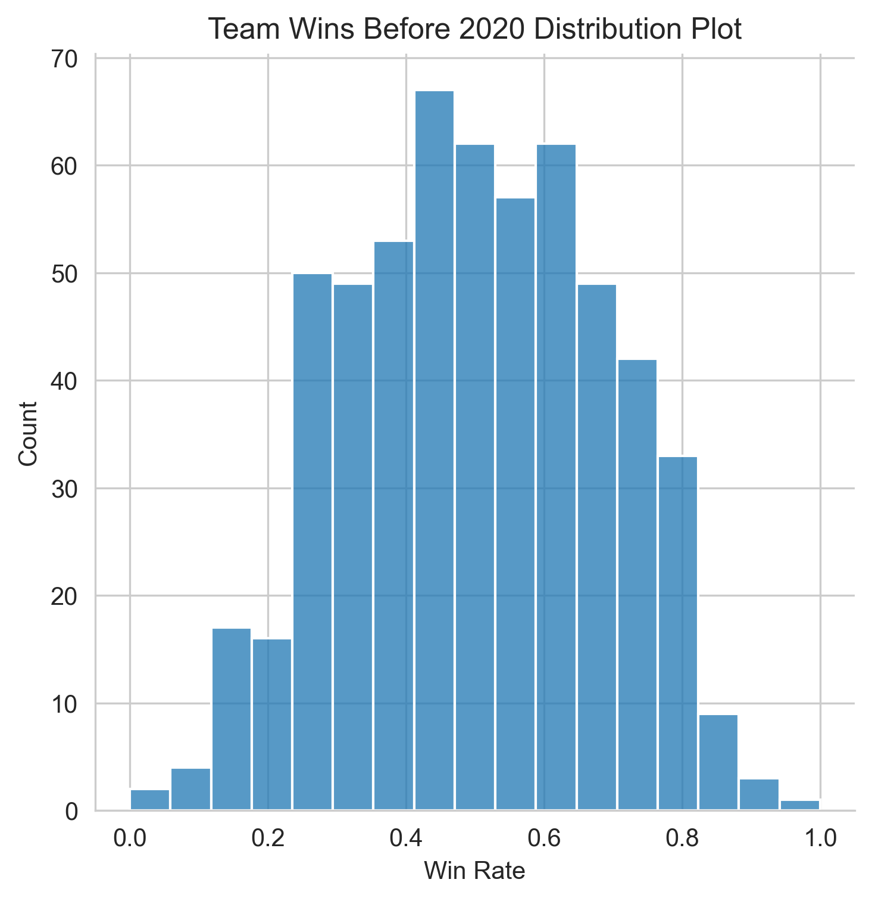


I performed Sharpiro-Wilk, scipy.stats normal test, and Anderson-Darling tests for normality both including and excluding the 2020-2023 seasons.  Each test determined the data is not normally distributed, but the Shapiro-Wilk test statistic of 0.985 was very close to 1, and a test statistic near 1 indicates a normal distribution.  The data is stepped, so it is not truly normally distributed, but it's close enough to a normal distribution that I will assume normality and proceed with the regression.

I calculated the gini coefficient by team and season as well as sum of salary cap hit and cap percentage.  Then I added the average of the current and past season gini coefficient.  Here's a sample of the data:
  
```
                      team  season  cap_hit_sum  cap_percent_sum
0        arizona-cardinals    2014     99264014            73.03
1        arizona-cardinals    2015    121979201            82.12
2        arizona-cardinals    2016    111290277            70.00
3        arizona-cardinals    2017    104474970            60.79
4        arizona-cardinals    2018    107921249            60.36

                      team  season  cap_hit_gini_coef  avg_gini_coef_2_years
0        arizona-cardinals    2014           0.597684                    NaN
1        arizona-cardinals    2015           0.643391               0.620537
2        arizona-cardinals    2016           0.703863               0.673627
3        arizona-cardinals    2017           0.632705               0.668284
4        arizona-cardinals    2018           0.712755               0.672730  
```  
  
I graphed box and whisker plots of the salary cap hit data alongside the gini coefficient data.  Note the gini coefficient graph x-axis has a range of (0.4, 0.8).  The gini coefficients do not vary as much as they appear in the graph.
  

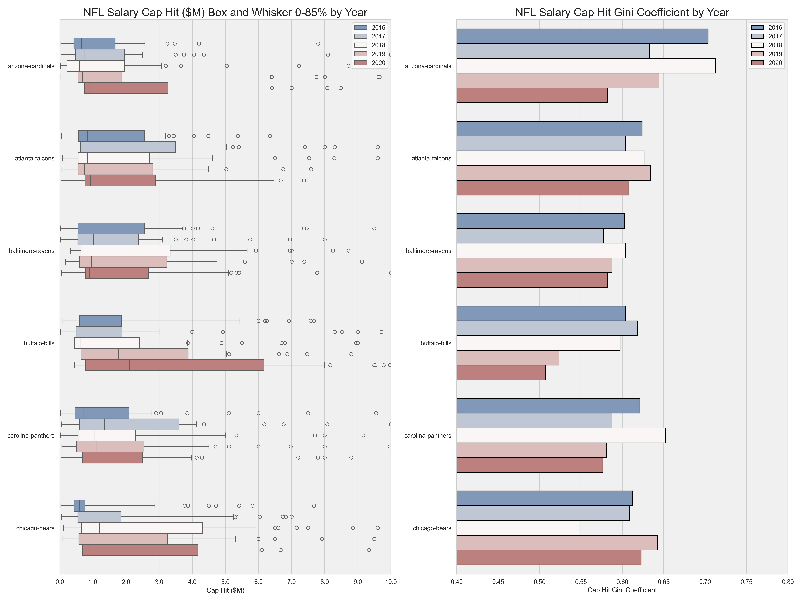
  
Here's a link to the same box and whisker and gini coefficient graphs with all teams included and a link to a Power BI report to explore salaries further.  In the Power BI report you can view individual player salaries by team for each season.

[Gini Coefficient Graphs](https://efruin-git.github.io/NFL-Salaries-Box-Whisker-Gini-Coef.html)

[NFL Salaries and Gini Coefficient Power BI Report](https://efruin-git.github.io/NFL_Salaries_and_Gini_Coefficient_PowerBI_Report.html)

In the cap hit and gini coefficient graphs, you'll notice greater median salaries correspond to lower gini coefficients (less salary inequality).  Team salary caps generally increase each year, so a small increase in median cap hit may not translate to a lower gini coefficient that year.  A wider interquartile range or wider whiskers will not necessarily change the gini coefficient.

#### Salary Cap Background
More context on the salary cap may be helpful to understand the data.  The league salary cap applies to each team and increases each year, but salary caps can very by team based on factors including unique player contracts, carry-over cap space from prior years, and dead cap space from releasing players with guaranteed money.  My data analysis uses salary cap hit and salary cap percentage from players on each team.  Dead cap space would prevent a team from using all their cap space, and total cap hit percentage would be lower for that team.  

Here's more info from Pro Football Network [Salary Cap](https://www.profootballnetwork.com/nfl-salary-cap-space-by-team):
>In 2025, the league set the base salary cap for all teams at $279.2 million. Each team then adds on any rolled-over money from the previous season. In essence, this is money that they did not spend against the previous cap. Some further adjustments based on contractual elements are then made to achieve a final number for each team.
>
>Per-game bonuses and incentives also count against the salary cap. How much they count against the cap in a single year is dependent on various factors. Any incentives considered “likely to be earned” count against the cap in that year, and if the player does not reach the threshold, the team pays back the incentives in the form of cap credits as part of cap adjustments.

Player salary distributions can very widely by team.  Below are box and whisker plots of salary cap hit by amount and percent for each team in 2020.

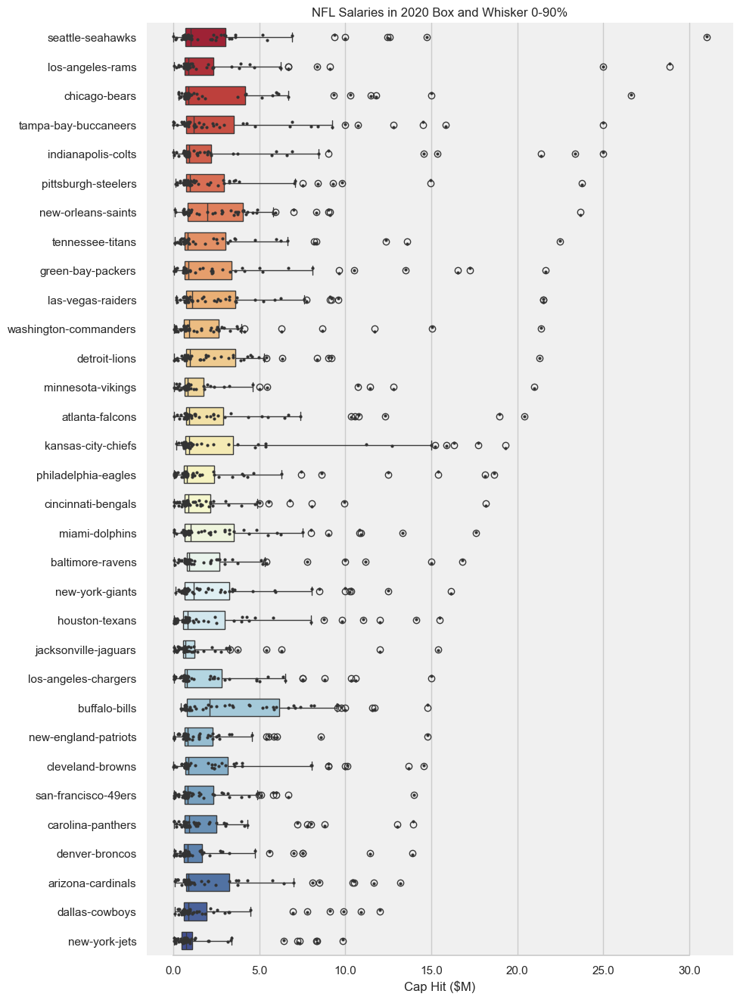

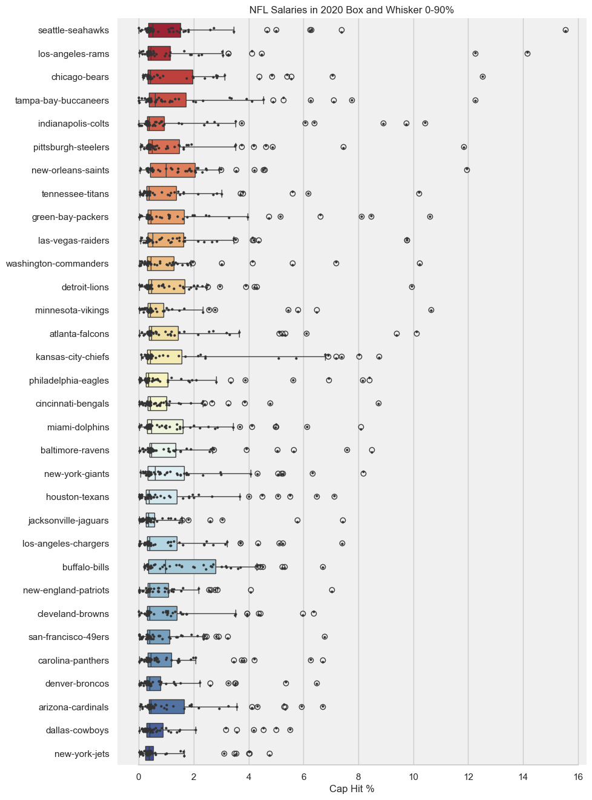

#### Data Cleaning
The data sets I used in my analysis were complete.  The only fields missing values were ties and "mov".  I did not use the "mov" field, and blank rows in the tie field correspond to 0 ties.  Some team names change over time, and some teams move locations.  The team names used in my analysis included both location and team name, so I had to clean that data.  I used the most recent team name and location for each team, and I back-filled team names that changed.  I had to create a team name mapping to join the data sets, because the team names in the data sets had different string values.  I joined the salary cap and team stats data sets on team and season.

#### Regression Work Outline
I performed a series of regression analyses against the win-loss percentage variable (win rate).  First I regressed gini coefficient and team total cap percentage data against win-loss percentage.  I added team statistics to those regressions, then performed a machine-learning style polynomial regression.  Lastly I performed a regression using salary data and past season performance to predict WLP.

### Regression: Win-Loss Percentage vs. Gini Coefficient and Salary Cap Percentage
I used the statsmodel package in Python to analyze salary cap data and WLP.  My initial regression of salary cap hit gini coefficient against WLP resulted in a valid model, but a very low adjusted R^2.  Only a small amount of variance in winning can be explained by team income inequality.

##### Code used
  
```
import statsmodels.api as sm

chgc=df_nfl_combined_2014_2020[['cap_hit_gini_coef']]
wlp=df_nfl_combined_2014_2020[['win_loss_perc']]

x = sm.add_constant(chgc)

model2 = sm.OLS(wlp,x).fit()

print(model2.summary())
```
  
##### Review Adj. R-squared for variance explained, Prob (F-statistic) for overall model fit, and P>|t| for individual variables.  F-statistic and p-values below 0.01 indicate a strong evidence of model accuracy and a relationship between the explanatory variables and the outcome variable.  
  
```

                            OLS Regression Results                            
==============================================================================
Dep. Variable:          win_loss_perc   R-squared:                       0.052
Model:                            OLS   Adj. R-squared:                  0.047
Method:                 Least Squares   F-statistic:                     12.06
Date:                Sun, 11 Jan 2026   Prob (F-statistic):           0.000618
Time:                        11:53:04   Log-Likelihood:                 54.364
No. Observations:                 224   AIC:                            -104.7
Df Residuals:                     222   BIC:                            -97.90
Df Model:                           1                                         
Covariance Type:            nonrobust                                         
=====================================================================================
                        coef    std err          t      P>|t|      [0.025      0.975]
-------------------------------------------------------------------------------------
const                 1.1803      0.196      6.015      0.000       0.794       1.567
cap_hit_gini_coef    -1.1114      0.320     -3.473      0.001      -1.742      -0.481
==============================================================================
Omnibus:                        5.192   Durbin-Watson:                   1.568
Prob(Omnibus):                  0.075   Jarque-Bera (JB):                3.525
Skew:                          -0.146   Prob(JB):                        0.172
Kurtosis:                       2.459   Cond. No.                         34.5
==============================================================================

Notes:
[1] Standard Errors assume that the covariance matrix of the errors is correctly specified.
```
  
Next I regressed the average of prior year and current year gini coefficient against WLP and got another valid model.  This time the adjusted R^2 was 0.07, a small improvement on the initial model.  In both cases, the coefficient for the variable was around -1 to -1.6, meaning the gini coefficient is inversely related to win rate.  Paying a few players high salaries leaves less money for the rest of the team, and football is a team sport.  It's important to have skilled players at every position.  Still, income inequality only explains a small amount of a team's win rate.

I tried regressing the sum of cap percentage (overall percent of team salary cap used) against WLP and got a better model, with 37% of the variance in winning explained by total cap percentage used.  
  
```

                            OLS Regression Results                            
==============================================================================
Dep. Variable:          win_loss_perc   R-squared:                       0.379
Model:                            OLS   Adj. R-squared:                  0.376
Method:                 Least Squares   F-statistic:                     135.3
Date:                Sun, 11 Jan 2026   Prob (F-statistic):           9.80e-25
Time:                        11:53:15   Log-Likelihood:                 101.75
No. Observations:                 224   AIC:                            -199.5
Df Residuals:                     222   BIC:                            -192.7
Df Model:                           1                                         
Covariance Type:            nonrobust                                         
===================================================================================
                      coef    std err          t      P>|t|      [0.025      0.975]
-----------------------------------------------------------------------------------
const              -0.2109      0.062     -3.402      0.001      -0.333      -0.089
cap_percent_sum     0.0101      0.001     11.633      0.000       0.008       0.012
==============================================================================
Omnibus:                        3.086   Durbin-Watson:                   1.695
Prob(Omnibus):                  0.214   Jarque-Bera (JB):                2.745
Skew:                          -0.258   Prob(JB):                        0.253
Kurtosis:                       3.166   Cond. No.                         428.
==============================================================================

Notes:
[1] Standard Errors assume that the covariance matrix of the errors is correctly specified.
```
    
There could be a number of reasons why cap percentage used is related to winning.  One reason would be dead cap space.  If a team releases a player they still have to pay that player's salary, and they can't use their full team cap space.  Another reason could be that teams rebuild, save cap space, roll it over each year, then spend more money when they're trying to win in the playoffs.  A team that uses more cap space could be using rolled over cap space on top of their annual allotment, which would mean they're spending more than other teams on their players.  If they spend wisely, they'll have more talented players on their team, assuming more expensive players are better players.  Another consideration is player contracts that award performance.  If players get bonus money for achieving performance milestones, they'll get paid more and use more of the cap space.

I combined average 2-year gini coefficient and total cap percentage in a regression against WLP.  The resulting model was statistically significant and explained 46.5% of the variance in win rate.
    
```
                            OLS Regression Results                            
==============================================================================
Dep. Variable:          win_loss_perc   R-squared:                       0.471
Model:                            OLS   Adj. R-squared:                  0.465
Method:                 Least Squares   F-statistic:                     84.08
Date:                Sun, 11 Jan 2026   Prob (F-statistic):           7.58e-27
Time:                        13:54:17   Log-Likelihood:                 102.68
No. Observations:                 192   AIC:                            -199.4
Df Residuals:                     189   BIC:                            -189.6
Df Model:                           2                                         
Covariance Type:            nonrobust                                         
=========================================================================================
                            coef    std err          t      P>|t|      [0.025      0.975]
-----------------------------------------------------------------------------------------
const                     0.2849      0.215      1.328      0.186      -0.138       0.708
avg_gini_coef_2_years    -0.8215      0.315     -2.609      0.010      -1.443      -0.200
cap_percent_sum           0.0104      0.001     11.887      0.000       0.009       0.012
==============================================================================
Omnibus:                        0.786   Durbin-Watson:                   1.617
Prob(Omnibus):                  0.675   Jarque-Bera (JB):                0.864
Skew:                          -0.051   Prob(JB):                        0.649
Kurtosis:                       2.688   Cond. No.                     2.56e+03
==============================================================================

Notes:
[1] Standard Errors assume that the covariance matrix of the errors is correctly specified.
[2] The condition number is large, 2.56e+03. This might indicate that there are
strong multicollinearity or other numerical problems.
```
  
Next, I plotted residuals from the model and fitted values against WLP to review model performance visually.
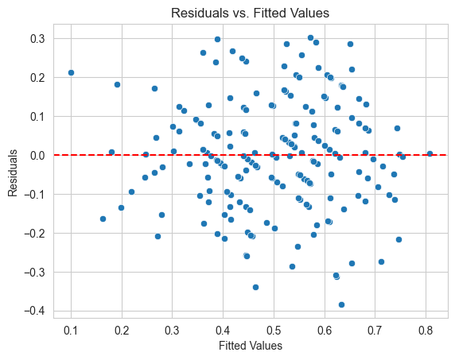
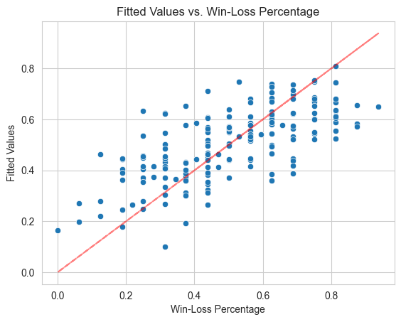

The residuals are evenly distributed but are fairly widely disbursed.  The fitted values are below actual results for high win rates and above actual results for low win rates.  The model is predicting values closer to average for most teams.  The results are decent, though.

### WLP vs. Salary Data & Team Stats
I added in the following variables to the multiple linear regression model - number of plays on offense, yards per play offense, penalties on offense, pass yards on offense, rush yards on offense, turnovers on offense, and points by opponents.  I selected variables I thought would be useful in predicting win rate without being too directly related to winning and without being redundant.  Instead of using interceptions, fumbles, and turnovers, I just used turnovers.  Instead of using pass net yards per attempt, pass attempts, passing touchdowns, and passing first downs, I used total pass yards.  Here's a heatmap of the correlation matrix with the new variables.

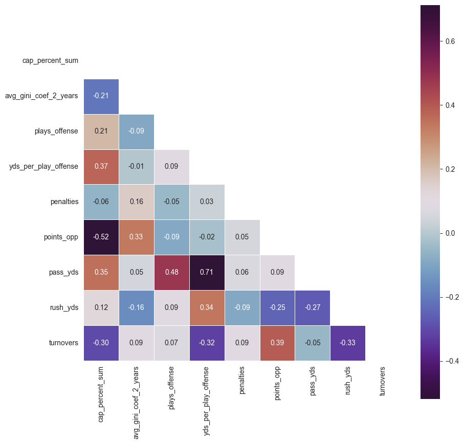

There's a high amount of correlation between opponent points and cap percent sum, pass yards and yards per play offense, and pass yards and plays offense.

Here's the initial regression model summary with the new variables:
  
```
 OLS Regression Results
==============================================================================
Dep. Variable:          win_loss_perc   R-squared:                       0.759
Model:                            OLS   Adj. R-squared:                  0.747
Method:                 Least Squares   F-statistic:                     63.70
Date:                Mon, 05 Jan 2026   Prob (F-statistic):           1.48e-51
Time:                        20:41:07   Log-Likelihood:                 178.20
No. Observations:                 192   AIC:                            -336.4
Df Residuals:                     182   BIC:                            -303.8
Df Model:                           9
Covariance Type:            nonrobust
=========================================================================================
                            coef    std err          t      P>|t|      [0.025      0.975]
-----------------------------------------------------------------------------------------
const                     1.6572      1.207      1.373      0.171      -0.724       4.038
cap_percent_sum           0.0043      0.001      5.462      0.000       0.003       0.006
avg_gini_coef_2_years    -0.2328      0.229     -1.015      0.312      -0.685       0.220
plays_offense            -0.0013      0.001     -1.083      0.280      -0.004       0.001
yds_per_play_offense     -0.2104      0.223     -0.942      0.347      -0.651       0.230
penalties                -0.0004      0.000     -0.743      0.458      -0.001       0.001
points_opp               -0.0013      0.000     -7.784      0.000      -0.002      -0.001
pass_yds                  0.0003      0.000      1.409      0.161      -0.000       0.001
rush_yds                  0.0004      0.000      1.641      0.103   -7.49e-05       0.001
turnovers                -0.0075      0.001     -5.300      0.000      -0.010      -0.005
==============================================================================
Omnibus:                        1.586   Durbin-Watson:                   2.090
Prob(Omnibus):                  0.452   Jarque-Bera (JB):                1.262
Skew:                          -0.183   Prob(JB):                        0.532
Kurtosis:                       3.156   Cond. No.                     7.55e+05
==============================================================================
```
  
After reviewing the p-values for each variable and the correlation matrix, I removed variables and ran the model again.  I did this step a few times before reaching the final model.  I used AIC and BIC to determine the best model.
  
```
                            OLS Regression Results
==============================================================================
Dep. Variable:          win_loss_perc   R-squared:                       0.755
Model:                            OLS   Adj. R-squared:                  0.748
Method:                 Least Squares   F-statistic:                     114.4
Date:                Mon, 05 Jan 2026   Prob (F-statistic):           8.30e-55
Time:                        20:28:50   Log-Likelihood:                 176.44
No. Observations:                 192   AIC:                            -340.9
Df Residuals:                     186   BIC:                            -321.3
Df Model:                           5
Covariance Type:            nonrobust
===================================================================================
                      coef    std err          t      P>|t|      [0.025      0.975]
-----------------------------------------------------------------------------------
const               0.2242      0.113      1.976      0.050       0.000       0.448
cap_percent_sum     0.0045      0.001      5.688      0.000       0.003       0.006
points_opp         -0.0013      0.000     -8.309      0.000      -0.002      -0.001
pass_yds         9.412e-05   1.55e-05      6.053      0.000    6.34e-05       0.000
rush_yds            0.0002   2.47e-05      6.255      0.000       0.000       0.000
turnovers          -0.0077      0.001     -5.732      0.000      -0.010      -0.005
==============================================================================
Omnibus:                        1.473   Durbin-Watson:                   2.113
Prob(Omnibus):                  0.479   Jarque-Bera (JB):                1.193
Skew:                          -0.184   Prob(JB):                        0.551
Kurtosis:                       3.116   Cond. No.                     6.80e+04
==============================================================================
```
  
A couple notable variables did not make the final model.  Average gini coefficient over 2 years did not make the final model and neither did penalties.  When current season offensive and defensive production are included, income inequality is an insignificant variable.  Cap percent sum is still a significant variable, though.  I was surprised that offensive penalties did not factor into win rate.  Maybe some highly penalized teams are undisciplined, while some are good teams that push the boundary of legal play.

Points opponent summarizes defensive production.  Pass yards, rush yards, and turnovers are key components of offensive production.  Turnovers proved to be a key variable in offensive success.  Teams have to protect the football on offense to win.

The final model explained 75% of the variance in win rate and had very low AIC and BIC values.  It  is a very good model, which is confirmed by the residual and fitted value plots below.  

  
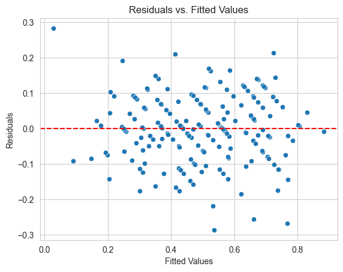
  
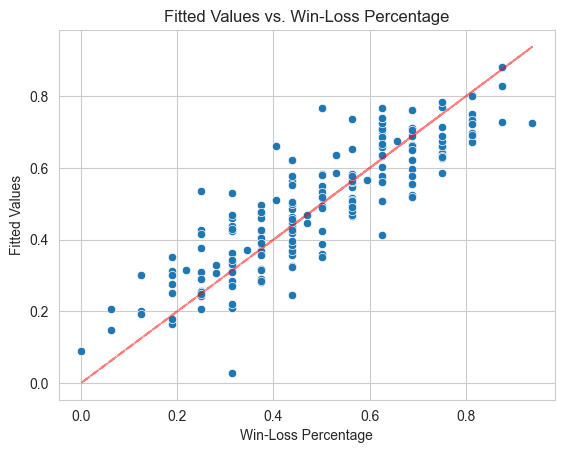

The final model used results of current year team performance on offense and defense to predict win rate.  I wanted to see if a polynomial regression would improve the accuracy of the model, and if prior year performance could be used to predict win rate.

### Machine Learning Polynomial Regression

I used the Sci-kit learn machine learning model for my polynomial regression.  I started with a linear regression model using the same variables as were found significant in the previous statsmodel package linear regression.  I split the data 70/30 for the training and test split.  After fitting a linear regression model I calculated the test data residuals by taking the difference of test data WLP and predicted values.  I calculated Mean Absolute Error and Root Mean Squared Error values of 0.074 and 0.095 respectively.
  
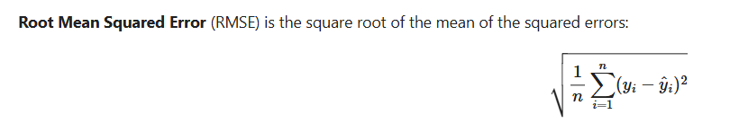
  

The plot of residuals against WLP, the distribution plot of residuals, and the probability plot of residuals show a fairly normal distribution of residuals, but with the mode slightly below zero.

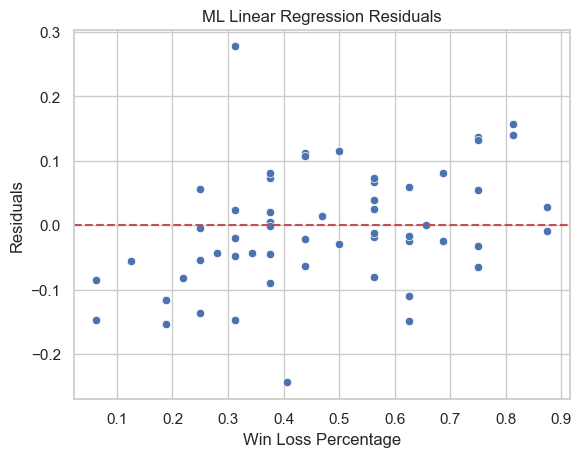
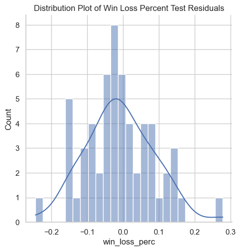
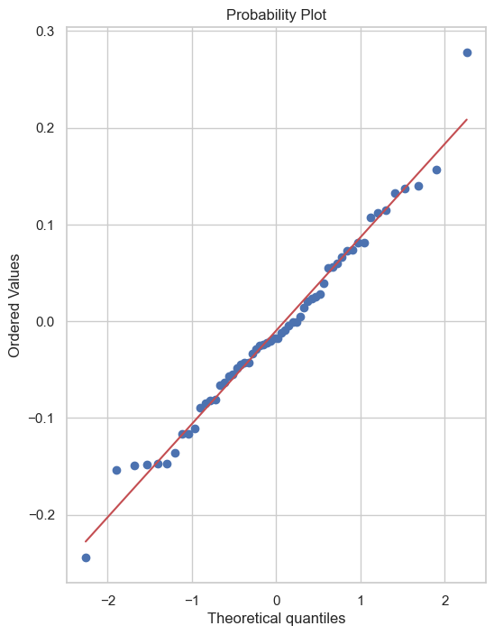


The coefficients generated in the model are listed below.  They are very similar to the results with the statsmodel package.  The pass yards and rush yards coefficients are small because total pass and rush yards per season reach thousands of yards.
  
```
                  Coefficient
cap_percent_sum	  0.004549
cap_hit_gini_coef	-0.436590
points_opp	      -0.001346
pass_yds	        0.000086
rush_yds	        0.000151
turnovers	        -0.007203
```

I multiplied the mean values for each variable by each coefficient and got this result, with each product having a similar magnitude, indicating each variable has an influence in the final model.
  
```
cap_percent_sum      0.313549
cap_hit_gini_coef   -0.268306
points_opp          -0.496119
pass_yds             0.327860
rush_yds             0.272121
turnovers           -0.158455
```

After the machine learning linear regression I performed a polynomial regression with the goal of finding a model that can estimate win rate at the high and low ends more accurately.  Here's the code I used to create my polynomial model.
  
```
from sklearn.preprocessing import PolynomialFeatures
from sklearn.model_selection import train_test_split

polynomial_converter = PolynomialFeatures(degree=2,include_bias=False)

df_nfl_combined_modeling_vars_wtarget = df_nfl_combined_2014_2020[df_nfl_combined_2014_2020['season']>2014][['win_loss_perc','cap_percent_sum','cap_hit_gini_coef','points_opp','pass_yds','rush_yds','turnovers']]

X = df_nfl_combined_modeling_vars_wtarget.drop('win_loss_perc',axis=1)
y = df_nfl_combined_modeling_vars_wtarget['win_loss_perc']

poly_features = polynomial_converter.fit_transform(X)

X_train, X_test, y_train, y_test = train_test_split(poly_features, y, test_size=0.3, random_state=101)

```
  
I calculated Mean Absolute Error and Root Mean Squared Error values of 0.089 and 0.117 respectively, both worse than the ML linear regression model.  The test data residuals were no better than the ML linear regression model.  The linear regression model is the better model.


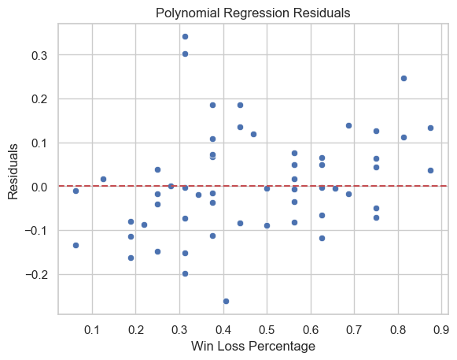
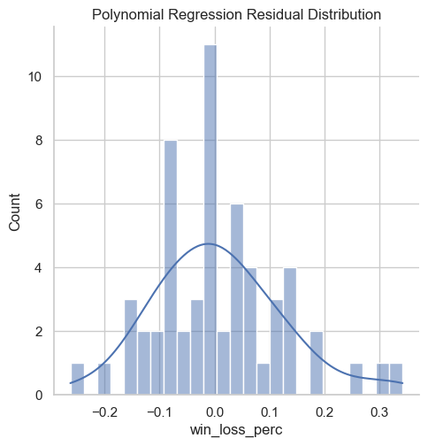
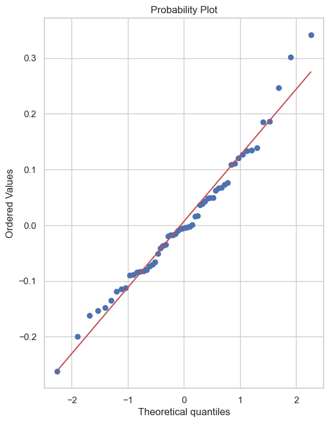

  
### WLP vs. Salary Data & Team Stats Predictive Model

  
In an attempt to create a model that is more predictive of future performance, I added team stats data lagged one and two years, and continued my regression work using the statsmodel package.  Upon investigating the salary data again, I found that in the presence of the cap percent sum variable, the current year gini coefficient value is more significant than the average of the current and prior year gini coefficient.  I will use the current year gini coefficient variable in the predictive model.
  
```
                            OLS Regression Results                            
==============================================================================
Dep. Variable:          win_loss_perc   R-squared:                       0.477
Model:                            OLS   Adj. R-squared:                  0.469
Method:                 Least Squares   F-statistic:                     57.14
Date:                Sat, 10 Jan 2026   Prob (F-statistic):           2.66e-26
Time:                        13:44:01   Log-Likelihood:                 103.80
No. Observations:                 192   AIC:                            -199.6
Df Residuals:                     188   BIC:                            -186.6
Df Model:                           3                                         
Covariance Type:            nonrobust                                         
=========================================================================================
                            coef    std err          t      P>|t|      [0.025      0.975]
-----------------------------------------------------------------------------------------
const                     0.2683      0.214      1.253      0.212      -0.154       0.691
avg_gini_coef_2_years    -0.0964      0.581     -0.166      0.868      -1.242       1.050
cap_hit_gini_coef        -0.7136      0.481     -1.483      0.140      -1.663       0.235
cap_percent_sum           0.0106      0.001     12.015      0.000       0.009       0.012
==============================================================================
Omnibus:                        0.238   Durbin-Watson:                   1.592
Prob(Omnibus):                  0.888   Jarque-Bera (JB):                0.393
Skew:                          -0.030   Prob(JB):                        0.822
Kurtosis:                       2.787   Cond. No.                     4.97e+03
==============================================================================

Notes:
[1] Standard Errors assume that the covariance matrix of the errors is correctly specified.
[2] The condition number is large, 4.97e+03. This might indicate that there are
strong multicollinearity or other numerical problems.
```

  
To check whether the predictive model would perform better without salary data I regressed WLP against 1 and 2 year lagged opponent points, pass yards, rush yards, and turnovers.  The best model I could fit with those team stats explained ~16.5% of the variance in win rate.  With salary cap data added back into the model I was able to explain ~44.5% of the variance in win rate.  

  
```
                            OLS Regression Results                            
==============================================================================
Dep. Variable:          win_loss_perc   R-squared:                       0.457
Model:                            OLS   Adj. R-squared:                  0.447
Method:                 Least Squares   F-statistic:                     46.10
Date:                Sat, 10 Jan 2026   Prob (F-statistic):           4.55e-28
Time:                        15:01:28   Log-Likelihood:                 116.86
No. Observations:                 224   AIC:                            -223.7
Df Residuals:                     219   BIC:                            -206.7
Df Model:                           4                                         
Covariance Type:            nonrobust                                         
=====================================================================================
                        coef    std err          t      P>|t|      [0.025      0.975]
-------------------------------------------------------------------------------------
const                 0.5765      0.186      3.096      0.002       0.210       0.943
cap_hit_gini_coef    -0.7639      0.246     -3.103      0.002      -1.249      -0.279
cap_percent_sum       0.0093      0.001     11.054      0.000       0.008       0.011
points_opp_y1        -0.0004      0.000     -2.045      0.042      -0.001   -1.49e-05
turnovers_y1         -0.0048      0.002     -2.648      0.009      -0.008      -0.001
==============================================================================
Omnibus:                        1.948   Durbin-Watson:                   2.019
Prob(Omnibus):                  0.378   Jarque-Bera (JB):                1.651
Skew:                          -0.199   Prob(JB):                        0.438
Kurtosis:                       3.135   Cond. No.                     1.16e+04
==============================================================================

Notes:
[1] Standard Errors assume that the covariance matrix of the errors is correctly specified.
[2] The condition number is large, 1.16e+04. This might indicate that there are
strong multicollinearity or other numerical problems.
```


The residual and fitted value plots show the same issue from earlier regressions of fitted values closer to the mean for teams with high and low actual win rates.


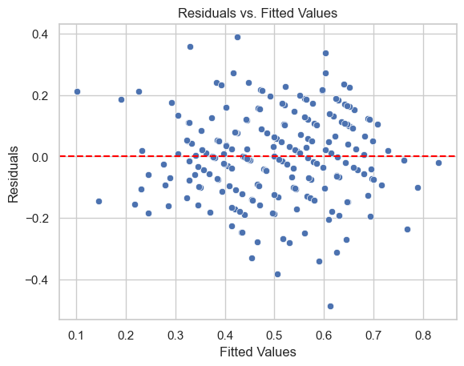
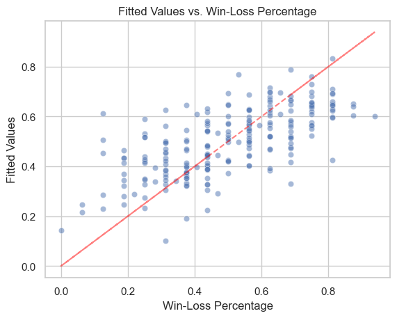
  

The best predictive model uses salary cap variables of team cap percent and gini coefficient.  It uses prior year team stats of opponent points and offensive turnovers.  No team stats from the 2 year lagged data were found to be significant.  Prior year passing yards and rush yards were not significant either.  Spending more of the salary cap with less income inequality, along with defensive strength and preventing turnovers on offense were the factors leading to more wins, and they were able to explain a little less than half the variability in win rate.


[back](./)
