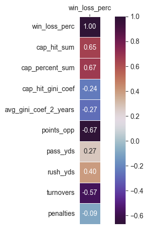

## Welcome to My NFL Salaries Regression Project Page (regression work half-way down).

1/7/2025  
I'm a pro football fan and root for my hometown team, the Chicago Bears.  I'm excited about the team's direction.  We have a great new coach, Ben Johnson, who has led the Bears to offensive production near the top of the NFL.  The Bears made the playoffs this year for the first time since 2020.  They've had a rough last 20 years.  The only other times they've made it to the playoffs since their Super Bowl appearance in 2006 were in 2010 and 2018.  I'm hoping for some better years ahead.

A big topic of conversation in professional sports is salaries.  I hear a lot of people say so-and-so deserves to get paid, they deserve they're money!  When players do get paid, sometimes they play well and sometimes they don't.  Sometimes they get injured and their salary is wasted.  With the playoffs upon us, I thought it would be interesting to see who's getting paid the big bucks and whether their teams are in the playoffs.  Are the big money players worth it?  How much do they influence a team's performance?

I looked up the top salaries in the NFL and found this site.  [Top 25 NFL Salaries in 2025](https://www.nfl.com/photos/ranking-the-nfl-s-biggest-contracts-for-2025).  Let's compare the top money players to their team's performance in 2025.  Note there are 32 teams in the NFL, 16 teams in each Conference (NFC and AFC), and 14 make the playoffs.

_I will list player salaries in order, but multiple players from the same team together._

**Salary and Team Outcome:**

#1 Dak Prescott (QB) - $60M, **Dallas Cowboys**, team record: 7-9-1, 2nd NFC East, 12th in NFC
- The top salary player in the league did not make the playoffs.
- _MISSED PLAYOFFS_

#2 (tie) Josh Allen (QB) $55M, **Buffalo Bills**, team record: 12-5, 2nd AFC East, tied for 5th best record in NFL
- The Buffalo Bills are a perennial force.
- PLAYOFF TEAM

#2 (tie) Joe Burrow (QB) $55M, **Cincinnati Bengals**, team record: 6-11, 11th in AFC  
#19 Ja'Marr Chase (WR) $40.25M, **Cincinnati Bengals**
- Cincinnati was supposed to be a Super Bowl contender with their high-flying offense.  Perhaps they spent too much on their top players.
- _MISSED PLAYOFFS_

#2 (tie) Trevor Lawrence (QB) $55M, **Jacksonville Jaguars**, team record: 13-4, 1st AFC South, 4th best record in NFL
- Lawrence entered the league in 2021 and in his 5th season has the Jaguars rolling
- PLAYOFF TEAM

#2 (tie) Jordan Love (QB) $55M, **Green Bay Packers**, team record: 9-7-1, 2nd NFC North, 7 seed in NFC Playoffs  
#12 Micah Parsons (LB) $46.5M, **Green Bay Packers**
- Green Bay spent more money on top players than Cincinnati, but they have a much better record.
- PLAYOFF TEAM

#6 Tua Tagovailoa (QB) $53.1M, **Miami Dolphins**, team record: 7-10, 3rd AFC East, 10th in AFC
- _MISSED PLAYOFFS_

#7 (tie) Brock Purdy (QB) $53M, **San Francisco 49ers**, team record: 12-5, tied for 5th best record in the NFL
- Purdy earned less than $2M/year in 2023 and 2024, but he led the 49ers to the Super Bowl in 2023.  Last year the team went 6-11.  With Purdy starting they were 6-9.  This year Purdy's record was 7-2.  He missed 8 games due to injury.
- [Brock Purdy 2023 Salary Comparison](https://www.espn.com/espn/feature/story/_/id/38512080/nfl-quarterbacks-earn-san-francisco-49ers-brock-purdy-salary)
- PLAYOFF TEAM

#7 (tie) Jared Goff (QB) $53M, **Detroit Lions**, team record: 9-8, 9th in NFC  
#15 (tie) Aidan Hutchinson (DE), Detroit Lions
- _MISSED PLAYOFFS_

#9 Justin Herbert (QB) $52.5M, **Los Angeles Chargers**, team record: 11-6, 2nd AFC West, 7 seed in AFC Playoffs
- PLAYOFF TEAM

#10 Lamar Jackson (QB) $52M, **Baltimore Ravens**, team record: 8-9, 9th in AFC
- _MISSED PLAYOFFS_

#11 Jalen Hurts (QB) $51M, **Philadelphia Eagles**, team record: 11-6, 1st NFC East, 3 seed in NFC Playoffs
- PLAYOFF TEAM

#13 Kyler Murray (QB) $46.1M, **Arizona Cardinals**, team record: 3-14, 16th in NFC
- _MISSED PLAYOFFS_

#14 Deshaun Watson (QB) $46M, **Cleveland Browns**, team record: 5-12, 13th in AFC  
#20 (tie) Myles Garrett (DE) $40M, **Cleveland Browns**
- 2025 was Watson's 4th year on a huge contract with Cleveland.  He didn't play all year due to injury, and he missed half of last season as well.
- _MISSED PLAYOFFS_

#15 (tie) Patrick Mahomes (QB) $45M, **Kansas City Chiefs**, team record: 6-11, 12th in AFC
- Mahomes has played in the Super Bowl 5 times and won 3.
- _MISSED PLAYOFFS_

#15 (tie) Kirk Cousins (QB) $45M, **Atlanta Falcons**, team record: 8-9, 11th in NFC
- Cousins signed a big contract in 2024 and played most games that season.  He was replaced by the #8 pick rookie quarterback Michael Penix Jr. at the end of the season.  Cousins didn't play much this season until Penix Jr. got injured, and Cousin's ended the season with a 5-2 record.
- _MISSED PLAYOFFS_

#18 T.J. Watt (OLB) $41M, **Pittsburgh Steelers**, team record: 10-7, 1st AFC North, 4 seed in AFC Playoffs
- PLAYOFF TEAM

#20 (tie) Matthew Stafford (QB) $40M, **Los Angeles Rams**, team record: 12-5, 2nd NFC West, tied for 5th best record in NFL
- PLAYOFF TEAM

#22 Geno Smith (QB) $37.5M, **Las Vegas Raiders**, team record: 3-14, 14th in AFC  
#24 Maxx Crosby (DE) $35.5M, **Las Vegas Radiers**
- _MISSED PLAYOFFS_

#23 Danielle Hunter (DE) $35.6M, **Houston Texans**, team record: 12-5, 2nd AFC South, tied for 5th best record in NFL
- PLAYOFF TEAM

#25 Justin Jefferson (WR) $35M, **Minnesota Vikings**, team record: 9-8, 8th in NFC
- _MISSED PLAYOFFS_
  
  
20 teams in the NFL paid at least one player a top-25 salary in 2025.  Only 9 of those teams made the playoffs.  It's also interesting to note that the three teams tied in the NFL with the best record at 14-3, the Denver Broncos, New England Patriots, and Seattle Seahawks, did not pay any player on their team a top-25 salary.  In 2023 Brock Purdy led the San Francisco 49ers to the Super Bowl on a rookie contract worth less than $2M/year.  The Denver Broncos and New England Patriots have quarterbacks on rookie contracts worth $5M/year and $9M/year respectively.  The Chicago Bears and Carolina Panthers also made the playoffs, with quarterbacks on rookie contracts earning $9M-$10M/year.  The Houston Texans round out the five teams in the playoffs this year with quarterbacks on rookie contracts.
    
  

Here are several visuals I created in my regression.  They are improperly sized and out of order.  I plan on writing up my regression analysis and fixing the visuals in the next couple days.

[back](./)
