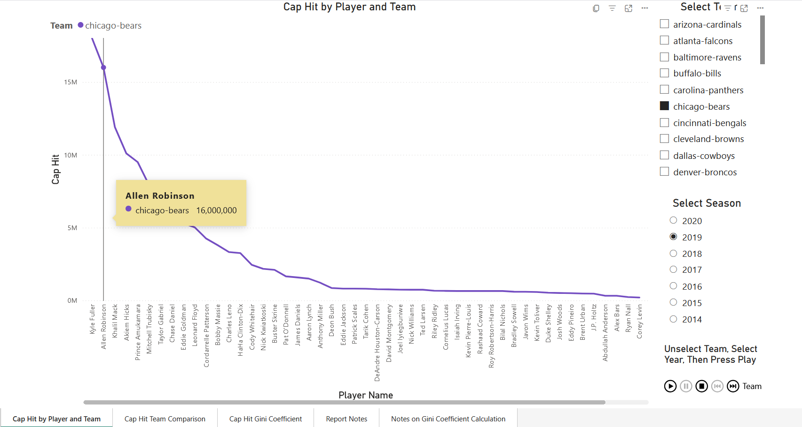
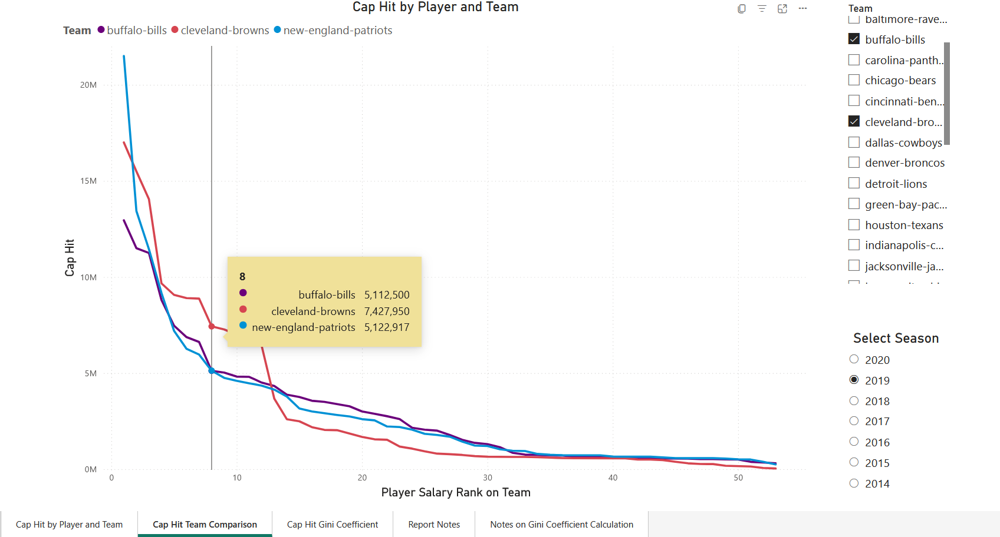
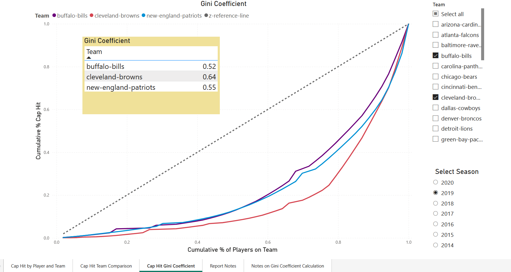
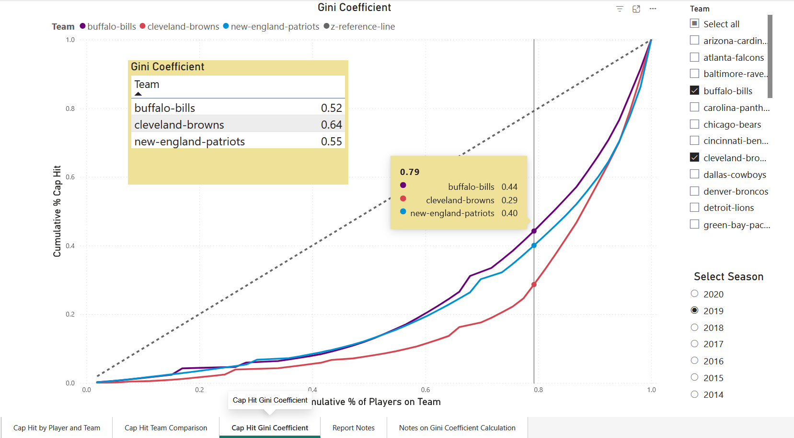
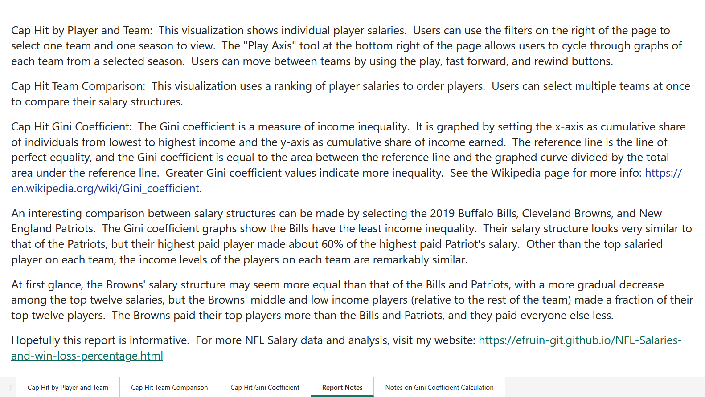
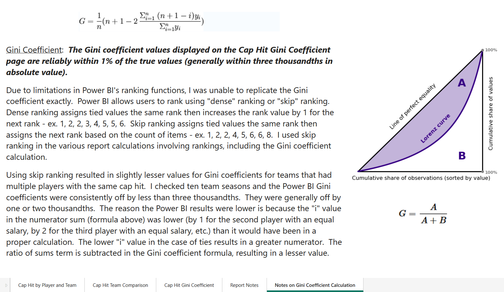

[Link to Power BI Report - Explore NFL Salaries and Gini Coefficient](https://app.powerbi.com/reportEmbed?reportId=0f594af5-af16-4110-b72d-8e4e536b44fc&autoAuth=true&ctid=87f457b7-df9f-4c5a-a1fa-7eb5150a5541)
 

The Power BI report may require viewers to login to their Microsoft or Power BI account.  I've provided screenshots of each tab so viewers can review the dashboard without having to login.  The dashboard has additional interactive features.  
 

  
 
     

  
 
 

  
 
 

  
 

* * *
  

* * *

#### Disclaimer:
I used AI to research and produce some of the code used in this report.  I did not use AI to edit or write any of the analysis.

[back](./)

